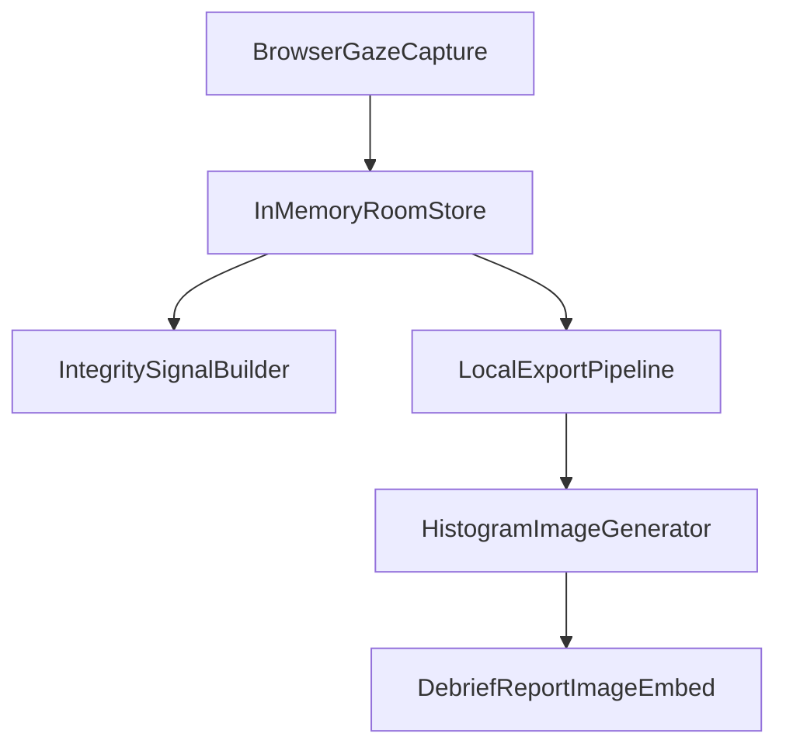

# Eye-Tracking Detection Review + Histogram Plan

## Status: planned

## Overview
- Audit the current gaze-cheating logic.
- Build a reusable pipeline to generate a real-session histogram image for the debrief report.
- Deliver a research-backed reliability evaluation and concrete architecture recommendations.

## Scope
- Review the existing gaze-cheating pipeline end-to-end in:
  - [`hooks/useGazeTracker.ts`](../hooks/useGazeTracker.ts)
  - [`components/GazeCalibration.tsx`](../components/GazeCalibration.tsx)
  - [`lib/ai-debrief.ts`](../lib/ai-debrief.ts)
  - [`app/api/rooms/[roomId]/route.ts`](../app/api/rooms/[roomId]/route.ts)
  - [`components/GazeHeatmap.tsx`](../components/GazeHeatmap.tsx)
- Build instrumentation + visualization for real sessions.
- Produce a detailed evaluation covering failure modes, expected false-positive/false-negative behavior, and alternatives.

## Confirmed Observations
- Current detection is threshold-driven and zone-based (on-screen vs off-screen direction).
- Gaze sampling runs at 2 Hz with 10-second off-screen streak events.
- Integrity logic combines gaze with tab/paste/fullscreen signals via fixed windows.
- Session data is in-memory today; no persisted analytics dataset exists yet.

## Proposed Architecture

## Implementation Plan
1. Add a local export path for completed room telemetry.
   - Return histogram-ready aggregates per room (zone counts, off-screen streak durations, paste-after-switch, gaze-paste correlations).
   - Keep payload analytics-focused (avoid returning full room blobs).

2. Add a deterministic histogram generator script.
   - Consume exported aggregates and create a report-quality PNG.
   - Include at least: off-screen ratio distribution, per-direction off-screen percentages, suspicious-correlation counts.
   - Save chart at a stable path for report embedding.

3. Integrate chart output into the AI report/debrief.
   - Add a report section that displays the histogram with sample-size/date-range caveats.
   - Handle no-data state gracefully until first real session is available.

4. Deliver a technical evaluation document.
   - Failure modes: lighting, eyewear, head movement, multi-monitor geometry, webcam quality/FPS, neurodivergent gaze patterns, accessibility accommodations.
   - Reliability analysis: realistic FP/FN tendencies at scale under current thresholds.
   - Comparative analysis:
     - Commercial positioning (ExamSoft, Honorlock, Proctorio).
     - Recent research benchmarks for webcam gaze accuracy and robustness.
     - Reference repos (OptiKey, GazeTracking, EyeGestures): calibration, landmarks, smoothing/fixation logic, head-motion handling.
   - Ranked recommendation set by impact vs complexity.

5. Update tracking docs after implementation.
   - Record decisions, what was implemented, open questions, and rejected approaches in the relevant feature note.

## Planned Outputs
- Report-ready histogram PNG generated from real sessions.
- Thorough reliability evaluation with concrete risks and confidence limits.
- Prioritized roadmap: quick wins, medium-term upgrades, and high-accuracy multi-signal architecture path.

## Task Checklist
- [ ] Implement local telemetry export endpoint for histogram-ready room aggregates.
- [ ] Create script to generate polished PNG histograms from real-session detection data.
- [ ] Embed histogram image into debrief/report with no-data fallback.
- [ ] Write detailed technical evaluation (failure modes, reliability, competitor/research comparison).
- [ ] Update relevant feature documentation with decisions and outcomes.
